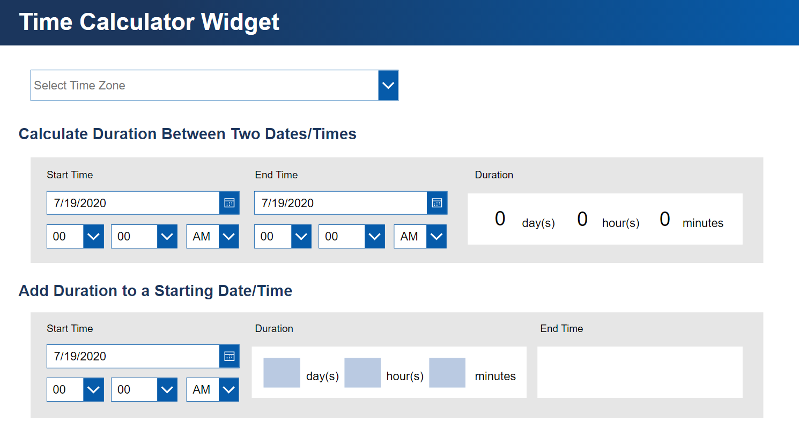
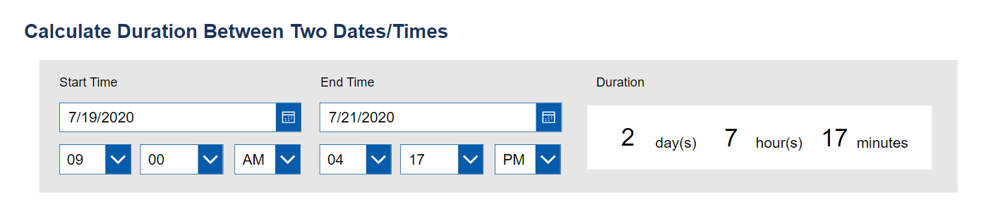
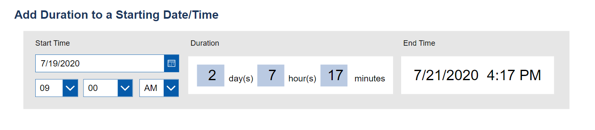

# Time Calculator Widget

> A Time Calculator Canvas App made in PowerApps that allows users to do calculations with time durations.

## Features

- Finds the time duration between two dates and times

- Adds a time duration (days, hours, minutes) to a starting date/time

## View Now

Checkout <a href="https://apps.powerapps.com/play/22e3db4e-3ca7-49a7-a49a-5024c7855982?tenantId=aaf653e1-0bcd-4c2c-8658-12eb03e15774">Time Calculator Widget Canvas App</a>

### Clone

- Clone this repo using `https://github.com/molly34762/Time-Calculator-Widget.git`

